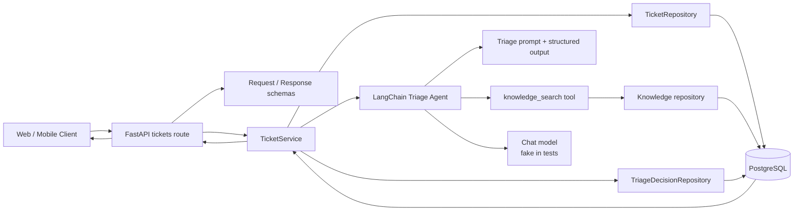
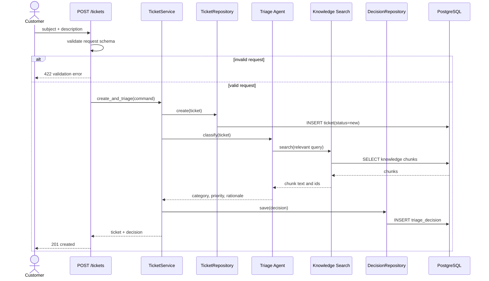
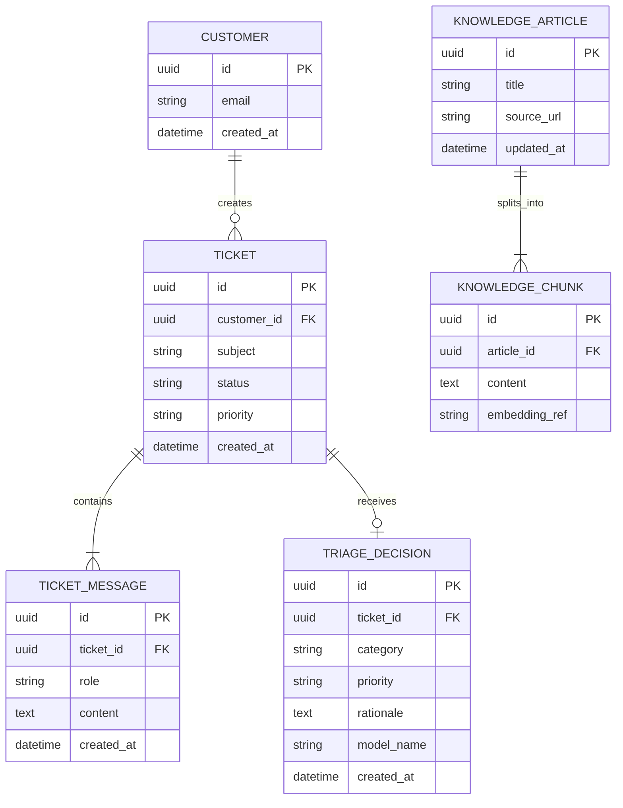

# Codex 進階開發：從能力擴充、理解專案到平行修改

> 本文件依 [`agenda.md`](agenda.md) 的「Codex 進階開發」重整，只保留 **Part 2｜進階能力**、**Part 3A｜理解專案**、**Part 3B｜動手修改**。三個 Part 使用同一個案例，依序完成「建立能力 → 建立證據 → 規劃與修改」。

## 課程順序與時間

| 時間 | Part | 主題 | 現場產出 |
| ---: | --- | --- | --- |
| 12–30 | **Part 2｜進階能力** | `AGENTS.md`、Config、Skills、Plugins、MCP、Worktree、Hooks | 可供 Part 3 使用的專案規範、能力與安全邊界 |
| 30–44 | **Part 3A｜理解專案** | 以唯讀方式理解 AI 客服工單服務，建立 codebase map 與證據 | 架構圖、request flow、DB ERD、未知事項與變更熱點 |
| 44–57 | **Part 3B｜動手修改** | 用 Plan mode 規劃，再用兩個 Worktree 平行實作 | 兩條可審查支線、Hooks 驗證結果與整合順序 |

講義提供完整的基礎到進階內容；18 分鐘的 Part 2 現場只示範每個模組的一個關鍵操作，其餘內容供講師備課與學員課後複習。

---

# Part 2｜進階能力

## Part 2 現場節奏

| 時間 | 模組 | 現場一定要做 |
| ---: | --- | --- |
| 12:00–14:30 | `AGENTS.md` | 用 `/init` 建立初稿，再補上真實命令、變更邊界與完成定義 |
| 14:30–17:00 | Config | 設定 Approval、Sandbox、Web search 與 Hooks feature |
| 17:00–20:00 | Skills | 說明 progressive disclosure；預裝 Mermaid 與 LangChain Skills |
| 20:00–22:00 | Plugins | 安裝 Ponytail，檢查它帶入的 Skills 與 Hooks |
| 22:00–24:00 | MCP | 加入文件型 MCP，示範工具白名單與逐工具 Approval |
| 24:00–27:00 | Worktree | 從同一基準分支建立兩個隔離工作區，說明 Handoff |
| 27:00–30:00 | Hooks | 審查與信任 Hooks；展示安全閘門與完成閘門 |

## 2.1 `AGENTS.md`：Repository 內的長期工作規範

### 基礎：它解決什麼問題

`AGENTS.md` 用來保存 Codex 在這個 Repository 中應長期遵守的規則，例如專案結構、真實可執行的驗證命令、禁止修改的範圍與 Definition of Done。不要把一次性任務或臨時需求塞入其中；一次性限制留在當次 Prompt。

Codex 會從全域層開始，再由 Git root 往目前工作目錄尋找指示；同層優先讀 `AGENTS.override.md`，否則讀 `AGENTS.md`。較接近目前工作目錄的指示會加入後面的 instruction chain。完整 discovery 規則見 [OpenAI：Custom instructions with AGENTS.md](https://learn.chatgpt.com/docs/agent-configuration/agents-md)。

### 從基礎到進階

1. **基礎層**：用 `/init` 產生初稿，確認 Codex 找得到 Repository root。
2. **可執行層**：將「寫好程式」改成確實存在的 setup、lint、test、type-check 指令。
3. **邊界層**：寫明不可修改的 public API、Production 資料、migration 與 secrets 規則。
4. **分層治理**：根目錄放全專案規則；例如 `app/repositories/AGENTS.override.md` 再加入 DB 專屬限制。
5. **驗證層**：實際詢問 Codex 載入了哪些檔案，不假設設定已生效。

### 課堂範例

先執行：

```text
/init
```

再將產生的內容整理成：

```markdown
# Repository purpose

This repository provides an AI-assisted support-ticket triage API.

## Setup and validation

- Install: `uv sync`
- Unit tests: `uv run pytest tests/unit -q`
- Integration tests: `uv run pytest tests/integration -q`
- Lint: `uv run ruff check .`
- Type check: `uv run mypy app`

## Change boundaries

- Do not access Production services or customer data.
- Do not change the public API or database schema without an approved plan.
- Never print `.env`, tokens, credentials, or raw ticket content.
- Prefer deterministic test doubles over a live LLM in tests.

## Definition of done

- Report changed files and behavior changes.
- Run relevant tests and state their results.
- State API, schema, migration, security, and rollback impact.
```

驗證 discovery：

```bash
codex --ask-for-approval never "Summarize the active project instructions and list their source files."
codex --cd app/repositories --ask-for-approval never "Show which instruction files are active."
```

### 常見錯誤

- 寫入「follow best practices」等無法驗收的抽象文字。
- 放入過長的框架文件，造成每次任務都消耗 context。
- 將權限設定寫在 `AGENTS.md`，卻沒有真的設定 Sandbox 或 Approval。
- 在子目錄建立規則後，沒有從該子目錄驗證實際載入順序。

## 2.2 Config：決定 Codex 可以怎麼執行

### 基礎：Config 與 `AGENTS.md` 的差異

- `AGENTS.md` 回答「在這個專案應怎麼工作」。
- `config.toml` 回答「模型、Sandbox、Approval、MCP、Hooks 等能力如何啟用」。

使用者預設位於 `~/.codex/config.toml`；專案可使用 `.codex/config.toml`。專案設定只有在 Repository 被信任時才會載入。CLI override、專案層、profile、使用者層與系統層具有明確優先順序，見 [OpenAI：Config basics](https://learn.chatgpt.com/docs/config-file/config-basic)。

### 從基礎到進階

1. **基礎層**：先設定 `approval_policy` 與 `sandbox_mode`。
2. **專案層**：只把團隊共享且適合版本控制的值放進 `.codex/config.toml`。
3. **能力層**：選擇 web search、Hooks 與 MCP；不要一次打開所有實驗功能。
4. **權限層**：Sandbox 決定最大可做範圍，Approval 決定何時必須請人確認，兩者不可混為一談。
5. **管理層**：企業環境還可能由 `requirements.toml` 或管理政策限制可用設定；專案設定不能繞過上層政策。

### 課堂範例

`.codex/config.toml`：

```toml
approval_policy = "on-request"
sandbox_mode = "workspace-write"
web_search = "live"

[features]
hooks = true
```

現場用三個問題檢查設定：

1. Codex 可以讀哪些路徑？
2. Codex 可以寫哪些路徑？
3. 哪些命令或網路行為仍需 Approval？

### 進階示範重點

- Review 任務可用較保守的 profile；實作任務再改用 workspace-write。
- 專案中不要寫入 token；MCP secrets 使用環境變數或 OAuth。
- 啟用 live web search 後仍應將網頁視為不受信任輸入，優先使用官方與一手來源。

## 2.3 Skills：按需載入的可重用工作方法

### 基礎：Skill 不是工具連線

Skill 是包含 `SKILL.md`、選用 scripts、references 與 assets 的工作流程。Codex 先看到名稱與 description，只有在任務符合或被明確點名時才讀取完整內容；這就是 progressive disclosure。官方說明與儲存位置見 [OpenAI：Build skills](https://learn.chatgpt.com/docs/build-skills)。

典型位置：

- Repository：`.agents/skills/<skill-name>/SKILL.md`
- 使用者：`$HOME/.agents/skills/<skill-name>/SKILL.md`
- 系統或管理層：由 Codex 或管理者提供

### 從基礎到進階

1. **使用既有 Skill**：讓 Codex依 task description 自動選擇，或在 Prompt 明確指定。
2. **檢查來源**：安裝前閱讀 `SKILL.md`、scripts、工具需求與資料外送行為。
3. **選擇 scope**：只給本專案就安裝在 Repository；多個 Worktree 都要用時可採使用者層安裝。
4. **建立團隊 Skill**：流程穩定且會重複使用時，再用 `$skill-creator` 建立；不要為單次任務建立 Skill。
5. **維護與測試**：description 要能正確觸發，也要寫清楚不該觸發的情況。

### Part 3 前置安裝一：Mermaid Skill

Part 3A 選擇 Mermaid，因為 `.mmd`／Markdown 可版控、可 review，且同一套 Skill 可產生架構圖、流程圖與 ERD。此為社群 Skill，課前必須先審查來源與 scripts：[Agents365-ai/mermaid-skill](https://github.com/Agents365-ai/mermaid-skill)。

```text
$skill-installer install https://github.com/Agents365-ai/mermaid-skill/tree/main/skills/mermaid-skill
```

若要本機 render，課前安裝 Mermaid CLI 與其 headless browser；現場若只需 Markdown，保留可驗證的 Mermaid source 即可：

```bash
npm install -g @mermaid-js/mermaid-cli
npx puppeteer browsers install chrome-headless-shell
mmdc --version
```

課堂使用方式：

```text
$mermaid-skill
請依實際程式碼證據產生目前系統的架構圖、建立工單流程圖與 DB ERD。
先輸出 Mermaid source，驗證語法，再輸出 SVG；不要補畫程式碼中找不到的關係。
```

### Part 3 前置安裝二：LangChain Skills

[LangChain 官方 Skills Repository](https://github.com/langchain-ai/langchain-skills) 提供 LangChain、LangGraph 與 Deep Agents 的建置指引；Repository 目前仍標示為 early development，因此要以版本控制與官方文件交叉驗證。為讓兩個 Worktree 都能使用，課堂環境採使用者層安裝：

```bash
npx skills add langchain-ai/langchain-skills --skill '*' --yes --global
```

Part 3B 只會使用下列相關 Skills，避免一次載入無關內容：

- `ecosystem-primer`：確認 LangChain、LangGraph 或 Deep Agents 的選型。
- `langchain-fundamentals`：核對 `create_agent`、tools 與 structured output。
- `langchain-middleware`：規劃 human-in-the-loop 與 middleware。
- `langchain-rag`：規劃 knowledge retrieval 與來源證據。

安裝後開新 task，確認 Skills selector 中可見；若未出現，重啟 Codex。

## 2.4 Plugins：把 Skills、連線與 Hooks 包成可安裝能力

### 基礎：何時不只需要 Skill

Skill 適合單一可重用工作法；Plugin 適合將多個 Skills、MCP-backed app／connector、MCP server 或 Hooks 一起安裝與分享。Plugin 仍受 Codex host 的 Sandbox 與 Approval 約束，且帶入的 Hooks 必須先審查與信任。見 [OpenAI：Plugins](https://learn.chatgpt.com/docs/plugins)。

### 從基礎到進階

1. **瀏覽與安裝**：先看 Plugin 內容、作者、權限與依賴。
2. **重新啟動 task**：新安裝的 bundled Skills 通常在新 task／session 才會完整可用。
3. **審查連線**：若包含 connector 或 MCP，確認資料範圍與 write actions。
4. **審查 Hooks**：Plugin 安裝不代表自動信任 Hooks；每次定義變動都要重新 review。
5. **團隊發佈**：只有當多個能力需要一起版本化與散布時，才建立內部 Plugin。

### Part 3 前置安裝：Ponytail Plugin

Ponytail 是第三方 Plugin，用「先確認是否需要、能否重用既有程式或標準函式庫，再寫最小實作」的 decision ladder 限制過度設計。它適合在 Plan review 與 Diff review 使用，不是框架 API 的權威資料來源。來源與安裝方式見 [DietrichGebert/ponytail](https://github.com/DietrichGebert/ponytail)。

```bash
codex plugin marketplace add DietrichGebert/ponytail
codex plugin add ponytail@ponytail
```

安裝後：

1. 重新啟動 Codex App 或 CLI。
2. 開啟 `/hooks`，逐一閱讀並信任 Ponytail 的兩個 lifecycle Hooks。
3. 開新 task，確認 Ponytail Skills 可見。
4. 規劃後使用安裝內容提供的 Ponytail review Skill 檢查是否過度抽象；以安裝後 selector 顯示的 invocation 為準。

### 課堂判斷題

- 只有一份固定 code-review checklist：用 Skill。
- 同時需要 review Skill、GitHub connector 與 lifecycle Hook：用 Plugin。
- 只需要一次性限制「這次不要新增 dependency」：放當次 Prompt。

## 2.5 MCP：連接即時資料與外部動作

### 基礎：MCP 與 Skill 的分工

- Skill 告訴 Codex「如何做」。
- MCP server 提供 Codex「可讀取的即時 context 或可執行的工具」。
- Plugin 可以負責散布 Skill，也可以帶入 MCP-backed app 或 MCP server。

Codex 可在 `config.toml` 設定本機 stdio 或遠端 HTTP MCP，並設定 server、enabled tools 與逐工具 approval。完整格式見 [OpenAI：Model Context Protocol](https://learn.chatgpt.com/docs/extend/mcp)。

### 從基礎到進階

1. **連線**：確認 command／URL、timeout 與必要環境變數。
2. **驗證**：用 `/mcp` 或 `codex mcp list` 確認 server 與工具可見。
3. **最小工具集**：只開啟這堂課需要的 read/search tools。
4. **Approval**：讀取與寫入工具分開設定；不因為 server 可連線就自動批准所有動作。
5. **Authentication**：OAuth server 使用 `codex mcp login <server-name>`；token 不寫入 Repository。

### 課堂範例：查核目前的套件文件

使用 OpenAI 文件中的 Context7 範例，讓 Part 3B 能在 LangChain Skill 之外查核目前套件文件：

```toml
[mcp_servers.context7]
command = "npx"
args = ["-y", "@upstash/context7-mcp"]
default_tools_approval_mode = "prompt"
startup_timeout_sec = 20
tool_timeout_sec = 45
enabled = true
```

現場 Prompt：

```text
請只使用 Context7 的 read/search 類工具，查核目前 LangChain Python 中
structured output、middleware 與 human-in-the-loop 的官方用法。
列出來源、版本假設與仍無法確認的事項；不要修改檔案。
```

若 MCP 無法使用，改查 LangChain 官方文件或 GitHub Repository；不以模型記憶補齊可能已變動的 API。

## 2.6 Worktree：讓多條修改支線彼此隔離

### 基礎：何時使用 Worktree

Worktree 是同一個 Git Repository 的另一份 checkout。每個 Worktree 有獨立檔案與 index，但共享 Git metadata，因此可以平行處理多條 branch，而不互相覆蓋工作目錄。

Codex-managed Worktree 與 Handoff 是 ChatGPT desktop app 的 Codex 能力；IDE-only 情境可使用原生 `git worktree`，但不會自動得到 App 的 task Handoff。官方行為、detached HEAD 與清理規則見 [OpenAI：Worktrees](https://learn.chatgpt.com/docs/environments/git-worktrees)。

### 從基礎到進階

1. **基礎層**：從乾淨且相同的 base commit 建立 Worktree task。
2. **分支層**：Worktree 預設可能是 detached HEAD；修改確定要保留時再使用 **Create branch here**。
3. **隔離層**：同一個 branch 不能同時 checkout 在兩個 Worktree。
4. **環境層**：每個 Worktree 都要有可重現的 setup script；不要假設 dependency 已存在。
5. **檔案層**：ignored files 不會自動進入 managed Worktree；只將安全、必要的本機檔案列入 `.worktreeinclude`。
6. **交付層**：用 Diff review 與 Handoff 將 task／code 移回 Local；不要讓兩個 Worktree 同時修改未分配的 shared files。

### 課堂示範

Part 2 只先建立兩個空白 Worktree task，真正的 branch contract 在 Part 3B Plan mode 核准後才填入：

```text
Base: main at the same clean commit
Worktree A: human-review gate
Worktree B: decision citations
```

`.worktreeinclude` 只列入無 Production secret 的本機測試設定：

```gitignore
.env.test
```

課前 local environment setup：

```bash
uv sync
uv run pytest tests/unit -q
```

## 2.7 Hooks：在 agent lifecycle 中執行確定性規則

### 基礎：Codex Hooks 不是 Git Hooks

Git Hooks 綁定 Git 動作；Codex Hooks 綁定 agent lifecycle，例如 `SessionStart`、`PreToolUse`、`PermissionRequest`、`PostToolUse` 與 `Stop`。適合把「不能只靠 Prompt 記得」的安全政策與驗證變成確定性程式。官方事件、輸入輸出與 trust 機制見 [OpenAI：Hooks](https://learn.chatgpt.com/docs/hooks)。

### 從基礎到進階

1. **觀察**：先用 Hook 記錄或顯示狀態，不直接阻擋。
2. **提醒**：用 `PostToolUse` 回饋格式或 lint 問題。
3. **阻擋**：用 `PreToolUse` 對特定 Bash／MCP tool 給 deny 決策。
4. **完成閘門**：用 `Stop` 執行快速測試；失敗時回傳 `continue: false` 與原因，讓 Codex繼續修正。
5. **信任與治理**：專案 Hooks 只在 trusted project 載入；新定義或內容 hash 改變後必須重新 review。

### Part 3 使用的兩個 Repository Hooks

`.codex/hooks.json`：

```json
{
  "hooks": {
    "PreToolUse": [
      {
        "matcher": "^Bash$",
        "hooks": [
          {
            "type": "command",
            "command": "/usr/bin/python3 \"$(git rev-parse --show-toplevel)/.codex/hooks/pre_tool_use_policy.py\"",
            "timeout": 10,
            "statusMessage": "Checking command safety"
          }
        ]
      }
    ],
    "Stop": [
      {
        "hooks": [
          {
            "type": "command",
            "command": "/usr/bin/python3 \"$(git rev-parse --show-toplevel)/.codex/hooks/stop_quality_gate.py\"",
            "timeout": 120,
            "statusMessage": "Running completion checks"
          }
        ]
      }
    ]
  }
}
```

兩個 script 的責任要保持單一：

- `pre_tool_use_policy.py`：解析 stdin JSON，只阻擋已明確列入政策的危險行為，例如 `rm -rf`、對非 localhost／test DB 執行 migration、輸出 `.env`；其他情況交回正常 Approval 流程。
- `stop_quality_gate.py`：在 `stop_hook_active` 為 false 時執行 `uv run ruff check .` 與 `uv run pytest -q`；失敗回傳 `continue: false` 與精簡錯誤，已進入第二次 Stop 時避免無限迴圈。

### Hooks 現場驗證

1. 開啟 `/hooks`，指出 Repository Hook 與 Ponytail Plugin Hook 的不同來源。
2. Review command、matcher、script 與資料流後才信任。
3. 送出一個安全命令，確認不會被誤擋。
4. 用測試 fixture 觸發一個禁止命令，確認 PreToolUse deny。
5. 暫時保留一個 failing test，確認 Stop Hook 不讓 task 宣稱完成；修正後再通過。

---

# Part 3A｜理解專案

## 3A.1 專案案例：SupportFlow AI

SupportFlow AI 是一個 FastAPI 模組化單體服務。客戶建立工單後，系統使用 LangChain triage agent 讀取知識庫片段，產生 category、priority 與 rationale，再寫入 PostgreSQL。測試使用 deterministic fake model，不需要現場呼叫付費或 Production LLM。

目前產品問題：

- 模型判斷沒有 confidence，低可信結果仍直接套用。
- 知識庫片段有被查詢，但沒有把來源證據保存到 decision。
- timeout 只回 503，Reviewer 很難從資料庫確認發生過什麼。

Part 3A 不先提出解法，而是確認這些問題是否能從 code、migration 與 test 得到證據。

## 3A.2 預先準備的 Codebase

```text
supportflow-ai/
├── AGENTS.md
├── .codex/
│   ├── config.toml
│   ├── hooks.json
│   └── hooks/
│       ├── pre_tool_use_policy.py
│       └── stop_quality_gate.py
├── .worktreeinclude
├── README.md
├── pyproject.toml
├── app/
│   ├── main.py
│   ├── api/routes/tickets.py
│   ├── schemas/ticket.py
│   ├── services/ticket_service.py
│   ├── agents/triage_agent.py
│   ├── agents/prompts.py
│   ├── tools/knowledge_search.py
│   ├── policies/escalation.py
│   ├── repositories/tickets.py
│   ├── repositories/triage_decisions.py
│   ├── db/models.py
│   └── db/session.py
├── migrations/versions/
├── tests/unit/
└── tests/integration/
```

## 3A.3 理解順序

1. 讀 `README.md`、`pyproject.toml`、`AGENTS.md`，確認啟動與驗證方式。
2. 從 `app/main.py` 找 route registration，而不是從檔名猜入口。
3. 由 `POST /tickets` 追蹤 schema → service → agent／tool → repository → response。
4. 讀 ORM model 與 migration，確認 DB 現況；若兩者不一致要列為風險。
5. 讀 unit／integration tests，確認哪些 error path 有可執行證據。
6. 將每個 diagram edge 連回檔案與 symbol；沒有證據的關係不得畫成已確認。
7. 最後才允許 Mermaid Skill 建立 `docs/codebase-map/` 下的三張圖。

## 3A.4 第一階段 Prompt：嚴格唯讀調查

```text
先不要修改任何程式、設定、migration 或測試。

請閱讀 README、pyproject.toml、AGENTS.md、app/、migrations/ 與 tests/，
追蹤 POST /tickets 從 request 到 PostgreSQL 與 response 的完整路徑。

輸出：
1. 建議閱讀順序與理由。
2. 模組責任與主要 symbols。
3. request → service → agent/tool → persistence → response 流程。
4. DB entities 與 migration 證據。
5. 每個結論的檔案路徑與行號／symbol。
6. 已確認、合理推測、待人工確認三類事項。
7. 目前測試覆蓋與最小重現步驟。
8. 可能的變更熱點；此時不要提出實作方案。
```

證據表至少包含：

| 結論 | 程式碼證據 | 狀態 |
| --- | --- | --- |
| `POST /tickets` 呼叫 `TicketService.create_and_triage` | route path、function call 與 integration test | 已確認 |
| agent 會查詢 knowledge chunks | tool binding、repository query 與 fake model test | 已確認 |
| decision 沒有保存 chunk IDs | ORM、migration、response schema | 已確認 |
| confidence threshold 應為 0.7 | 無產品規格或程式碼依據 | 待人工確認 |

## 3A.5 第二階段 Prompt：使用 Mermaid Skill 產生三張圖

在唯讀調查完成後，只開放寫入分析 artifact：

```text
$mermaid-skill

依剛才確認的程式碼證據，建立下列 current-state diagrams：
1. docs/codebase-map/architecture.mmd：codebase 架構圖。
2. docs/codebase-map/create-ticket-flow.mmd：POST /tickets 流程圖。
3. docs/codebase-map/database-erd.mmd：目前 DB ERD。

限制：
- 只可新增或修改 docs/codebase-map/。
- 每個 node／edge 必須能回指證據表。
- 推測關係用註解或待確認清單表示，不可畫成既有事實。
- 先驗證 Mermaid syntax，再 render 成 SVG。
- render 後檢查 label、方向與可讀性，最多修正兩輪。
```

## 3A.6 講師基準圖一：Current-state Codebase Architecture



圖旁必須附證據，例如 route registration、service call、tool binding、repository query 與 integration test；架構圖本身不能取代證據表。

## 3A.7 講師基準圖二：Current-state Create Ticket Flow



本圖刻意顯示 current state：agent 雖然取得 chunk IDs，但 decision insert 與 response 沒有來源欄位；這是 Part 3B 的候選 gap，不在 3A 先決定解法。

## 3A.8 講師基準圖三：Current-state DB ERD



ERD 應明確揭露兩個 schema gap：目前沒有 confidence 欄位，也沒有 `TRIAGE_DECISION` 到 `KNOWLEDGE_CHUNK` 的持久化關聯。這只是現況結論；是否新增欄位與 join table 要留給 Part 3B 的 Plan mode。

## 3A.9 完成標準與銜接

Part 3A 完成時必須有：

- 三張通過 syntax validation 的 Mermaid current-state diagrams。
- 每張圖的 edge-to-evidence 對照表。
- 已確認、推測、待確認的分離清單。
- 目前 API、DB、agent、tool 與 test contract。
- 兩個候選變更熱點，但尚未修改 source code。

Part 3B 只接受這些 artifact 與證據作為 planning input；若圖與程式碼衝突，以可重現的程式碼與測試為準並先修正圖。

---

# Part 3B｜動手修改

## 3B.1 修改目標

延續 Part 3A 的兩個已確認 gap，這一段實際完成兩條小型支線：

1. **Human-review gate**：agent structured output 增加 confidence；低於設定 threshold 時，不自動套用 priority，而將 ticket 標為 `pending_review`。
2. **Decision citations**：保存 decision 使用的 knowledge chunk IDs，並在 response 回傳最小來源資訊。

不在本段處理 UI、Production deployment、完整 queue 重構、向量資料庫替換或模型評測平台；這些都不屬於 13 分鐘修改範圍。

## 3B.2 先驗證 Part 2 能力

若 Part 2 已預裝，這裡只做驗證；若未完成，先依 Part 2 指令安裝：

```bash
# LangChain Skills
npx skills add langchain-ai/langchain-skills --skill '*' --yes --global

# Ponytail Plugin
codex plugin marketplace add DietrichGebert/ponytail
codex plugin add ponytail@ponytail
```

驗證清單：

- 新 task 可看到 `langchain-fundamentals`、`langchain-middleware`、`langchain-rag`。
- `/hooks` 可看到並已審查 Ponytail 的 lifecycle Hooks。
- Context7 MCP 可用；不可用時已準備 LangChain 官方文件 fallback。
- Repository 是 trusted，`.codex/config.toml` 與 `.codex/hooks.json` 已載入。
- `git status` 乾淨，兩個 Worktree 將從同一個 base commit 建立。

## 3B.3 使用 Codex Plan mode，不先寫程式

Plan mode 適合多步驟規劃；Codex 的 `/plan` 可切換此模式，見 [OpenAI：Slash commands](https://learn.chatgpt.com/docs/reference/slash-commands#available-slash-commands)。先輸入：

```text
/plan
```

接著貼入規劃任務：

```text
先不要修改檔案。使用 Part 3A 的架構圖、流程圖、ERD 與 evidence table，
規劃以下兩項修改：

A. agent output 增加 confidence；低可信 decision 進入 pending_review。
B. 保存 knowledge chunk citations，並在 API response 回傳最小來源資訊。

規劃前：
- 使用 LangChain Skills 查核 structured output、middleware／human-in-the-loop 與 RAG provenance。
- 使用 Context7 或 LangChain 官方文件驗證可能已變動的 API，不靠模型記憶。
- 使用 Ponytail 對方案做一次必要性與過度設計檢查，優先重用既有 schema、repository 與 policy。

輸出必須包含：
1. 現況證據與問題定義。
2. scope、non-goals、assumptions 與待產品確認事項。
3. API 與 DB migration 影響，以及 backward compatibility。
4. 兩個 Worktree 的 branch contract、檔案 ownership 與禁止交叉修改的 shared files。
5. 每條支線的測試、rollback 與完成標準。
6. merge 順序、預期 conflict 與整合驗證。
7. 需要人工核准的決策；在核准前維持 read-only。
```

### Plan 核准閘門

講師只在下列條件都滿足時批准實作：

- threshold 沒有規格時明確列為產品決策，不由 Codex 猜一個數字。
- migration 有 downgrade／rollback 設計。
- API 新欄位採 additive change，未任意破壞既有 client。
- fake model 與 fixture 可以 deterministic 驗證低／高 confidence。
- 兩條 branch 的檔案 ownership 清楚；shared schema conflict 已先指定 merge 順序。
- Ponytail review 沒有發現為了兩個欄位建立不必要 framework 或 service。

## 3B.4 使用兩個 Worktree 開啟平行支線

兩個 task 都從同一個乾淨 base commit 建立。Codex App 預設 managed Worktree 可能是 detached HEAD；確定要保留修改後，分別用 **Create branch here** 建立：

| Worktree | Branch | 主要責任 | 主要 Skills | 不可修改 |
| --- | --- | --- | --- | --- |
| A | `codex/human-review-gate` | confidence contract、review policy、status transition、migration 與 tests | `langchain-fundamentals`、`langchain-middleware` | citation response 與 source persistence |
| B | `codex/decision-citations` | retrieval provenance、decision sources、additive response 與 tests | `langchain-rag` | confidence threshold 與 review policy |

### Worktree A Prompt

```text
依已核准 Plan 實作 human-review gate。

限制：
- 只修改 branch contract 分配給 Worktree A 的檔案。
- 使用 LangChain structured output 的目前官方做法；API 不確定時先查 Skill 與官方文件。
- threshold 從設定注入；不要硬編碼未核准的產品數值。
- 測試使用 fake model，覆蓋 high-confidence、low-confidence 與 invalid output。
- migration 必須可 downgrade。
- 完成前執行 Ponytail diff review，再執行相關 unit／integration tests。
```

### Worktree B Prompt

```text
依已核准 Plan 實作 decision citations。

限制：
- 只修改 branch contract 分配給 Worktree B 的檔案。
- 重用 knowledge_search 已回傳的 chunk IDs，不新增第二套 retrieval abstraction。
- 新增最小持久化關聯與 additive response；不要回傳完整 chunk content。
- 測試 citation order、去重、找不到 article 的行為與既有 client compatibility。
- migration 必須可 downgrade。
- 完成前執行 Ponytail diff review，再執行相關 unit／integration tests。
```

### 平行修改時的講師觀察點

- Codex 是否真的遵守 branch ownership，而不是看到相關檔案就全改。
- Skills 是否只在相關任務載入，沒有把整個 LangChain 生態塞入 context。
- 查到的 API 是否能回指官方文件或 primary repository。
- Ponytail 是否讓方案更小，而不是刪掉必要 validation、security 或 error handling。
- 每個 Worktree 是否有獨立 setup、test result 與可審查 Diff。

## 3B.5 Hooks 在本段的實際角色

### Hook 1：PreToolUse Safety Gate

在 Codex 執行 Bash 前檢查：

- 阻擋 `rm -rf` 等明確 destructive pattern。
- 阻擋對非 localhost／test `DATABASE_URL` 執行 Alembic upgrade／downgrade。
- 阻擋 `cat .env`、`printenv` 搭配敏感 key 等 secrets exposure。
- 對未列入 deny policy 的命令不擅自 approve，仍交給正常 Sandbox／Approval。

現場只用 fixture payload 測試 Hook，不真的送出危險命令。

### Hook 2：Stop Quality Gate

Codex 準備結束 turn 時：

1. 先執行 `uv run ruff check .`。
2. 再執行 `uv run pytest -q`。
3. 任一失敗就回傳 `continue: false` 與最小錯誤摘要，讓 Codex繼續修正。
4. 讀取 `stop_hook_active` 防止失敗後無限重入。
5. 兩項通過才允許 task 宣告完成。

### Ponytail Plugin Hooks

Ponytail 自帶的 lifecycle Hooks 用來維持它的最小實作規則；Repository Hooks 負責安全與驗證。兩者來源與責任必須在 `/hooks` 中分開說明，不把第三方 Plugin Hook 當成專案安全政策的替代品。

## 3B.6 13 分鐘現場節奏

| 時間 | 動作 | 產出 |
| ---: | --- | --- |
| 44–46 | 驗證 Skills、Plugin、MCP、Hooks 與 clean base | 可重現的執行環境 |
| 46–49 | `/plan` 產生方案，使用 LangChain 資料與 Ponytail critique，人工核准 | 兩條 branch contract、migration／test／rollback plan |
| 49–51 | 從同一 base 建立 Worktree A、B 與對應 branches | 兩個隔離 task |
| 51–55 | 兩條支線平行修改；講師切換查看 Diff 與證據 | 實際 code、migration 與 tests |
| 55–57 | 觸發 Stop Hook、查看測試、執行 Ponytail diff review，決定 merge 順序 | 通過閘門的支線與整合清單 |

為了讓現場穩定，兩個 Worktree 的 dependency cache、fake model fixtures 與 base tests 要在課前完成；現場仍由 Codex 產生實際 Diff，不播放預錄結果。

## 3B.7 整合順序與完成標準

建議先整合 Worktree A，再 rebase／更新 Worktree B，因為 A 先定義 `TRIAGE_DECISION` 的 confidence 與 ticket status contract；B 再加入 `DECISION_SOURCE` 關聯與 response sources。若兩條 migration 形成 multiple heads，必須顯式處理，不可隱藏。

每條支線完成時必須具備：

- 只修改 branch contract 允許的檔案，任何例外都有理由。
- Diff 可回指 Part 3A 的 gap 與已核准 Plan。
- LangChain 用法有 Skill 加官方／primary source 的交叉驗證。
- Ponytail review 已執行，且沒有以「少寫程式」為由移除必要安全與錯誤處理。
- Migration upgrade／downgrade、unit tests、integration tests 與 lint 通過。
- Stop Hook 實際通過，不是只在回覆中宣稱已測試。
- 說明 API／DB 相容性、剩餘風險、rollback 與 merge 順序。
- 不 deploy、不連 Production、不使用真實客戶資料。
